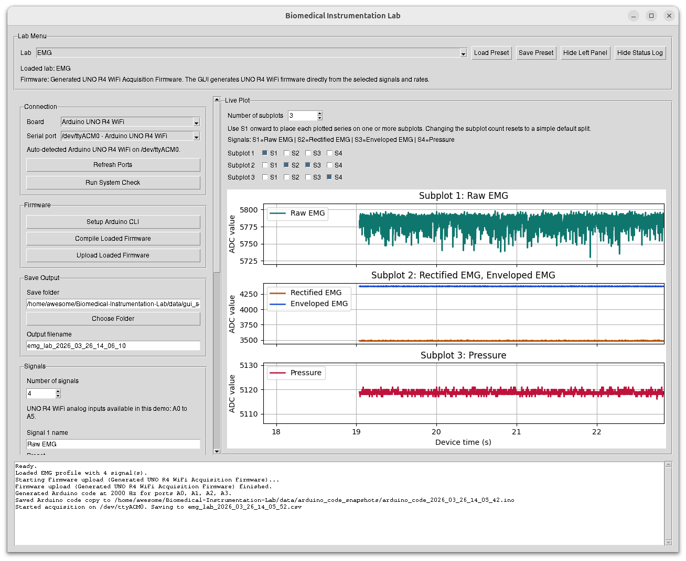
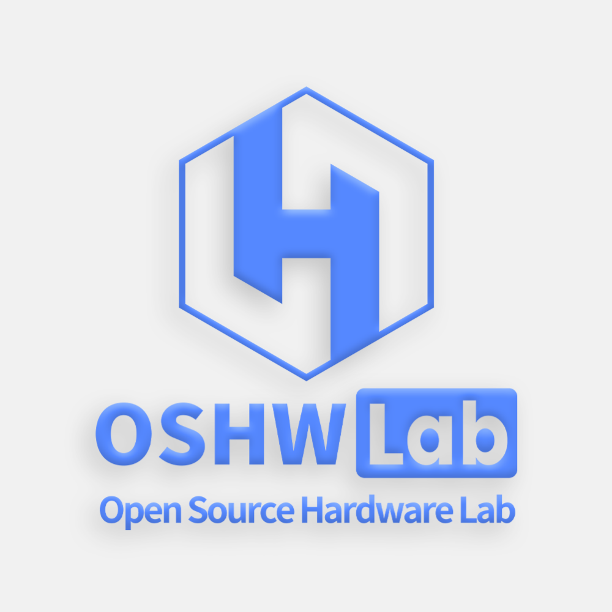
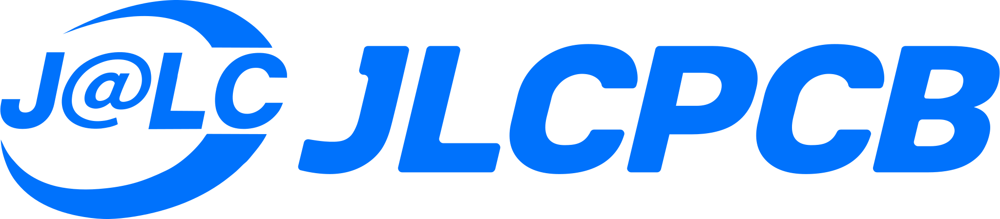

# Biomedical Instrumentation Lab

> Open educational hardware and software for hands-on biomedical instrumentation laboratories.

Biomedical Instrumentation Lab is a teaching-focused platform built around a **custom PCB**, **Arduino UNO R4 WiFi firmware**, and a **student-friendly Python GUI** for acquiring, visualizing, and saving physiological signals in the lab.

It is designed to support practical laboratory experiences in:

- **EMG**
- **ECG**
- **Pulse oximetry**
- **Blood pressure**
- and other analog or multi-phase biomedical sensing activities

---

## Author

<p align="center">
  <strong>Daniel Duque Urrego</strong><br>
  Ph.D. Student in Biomedical Engineering<br>
  West Virginia University
</p>

<p align="center">
  Passionate about <strong>biomedical instrumentation</strong>, <strong>open educational hardware</strong>, 
  <strong>biosignal acquisition</strong>, and creating hands-on tools that help students connect theory with real-world measurement systems.
  Experience with IMUs and upper limb applications.
</p>

<p align="center">
  Experience with IMUs and upper limb applications.
</p>

<p align="center">
  <a href="https://www.linkedin.com/in/danielduqueu/">
    
  </a>
  <a href="https://orcid.org/0000-0001-7924-8030">
    
  </a>
  <a href="mailto:dd00055@mix.wvu.edu">
    
  </a>
</p>

<p align="center">
  <a href="https://scholar.google.com/citations?user=Nrw8UxUAAAAJ&hl">
    
  </a>
  <a href="https://github.com/danielduqueurrego">
    
  </a>
</p>

---

## Why this project exists

Biomedical instrumentation courses often teach important concepts such as signal conditioning, filtering, amplification, sampling, and physiological sensing, but students do not always get a reusable, transparent, and affordable platform they can explore themselves.

This project was created to help close that gap.

The goals are to:

- make biomedical instrumentation more **hands-on**
- provide a platform that is **transparent and modifiable**
- reduce barriers for students and instructors
- support both **teaching** and **iterative development**
- connect circuit design, embedded acquisition, and signal analysis in one workflow

This repository brings together the hardware, firmware, desktop tools, examples, and documentation needed to support that vision.

---

## Project highlights

- **Custom educational PCB** for biomedical instrumentation labs
- **Arduino UNO R4 WiFi** firmware workflows
- **Cross-platform Python GUI** for student acquisition
- **Minimal setup path** using Conda + Arduino CLI
- Support for multiple acquisition models:
  - `CONT_HIGH`
  - `CONT_MED`
  - `PHASED_CYCLE`
- Session presets, validation tools, and example output files
- Teaching-oriented design with reusable lab workflows

---

## The board

The current PCB design is published on **OSHWLab**:

**Biomedical Instrumentation Board**  
[View the current PCB project on OSHWLab](https://oshwlab.com/dd00055/biomedical-instrumentation-board)

<!-- Add a board render or photo here later when a current classroom-ready image is available. -->

This board serves as the hardware foundation for the lab workflows in this repository and is being developed as an open educational platform for biosignal acquisition and instrumentation teaching.

---

## What this repository includes

This repository currently includes:

- reference Arduino firmware for continuous and phased-cycle acquisition
- generated firmware workflows for student-configured lab sessions
- a modular Python GUI for student use
- session presets for common lab types
- example CSV outputs showing the logging format
- setup documentation for students and instructors
- validation checklists and test workflows
- firmware compile checks and automated software tests

The public repository currently includes the following main areas: `docs`, `examples/session_csv`, `firmware`, `python`, `tests`, and `tools`, along with launch scripts for Linux, macOS, and Windows.

---

## How it works

The repository is organized by **acquisition pattern first**, rather than only by sensor type. This allows one software workflow to be reused across several lab activities. The repo’s current architecture and top-level organization reflect this pattern-first approach.

### Acquisition classes

- **CONT_HIGH**  
  High-rate continuous waveform acquisition  
  Example: EMG

- **CONT_MED**  
  Medium-rate continuous waveform acquisition  
  Examples: ECG, blood pressure, classroom analog demos

- **PHASED_CYCLE**  
  Multi-phase acquisition where signal meaning depends on timing phase  
  Example: pulse oximetry

This design helps keep the student experience consistent while still supporting very different lab types.

---

## Student workflow

The intended student workflow is:

1. connect the board
2. launch the GUI
3. load a lab preset
4. choose a save folder
5. compile/upload firmware if needed
6. start acquisition
7. save one session CSV

The current public repo already presents a “Start Here” path based on Conda, Arduino CLI, a system check, and launch scripts for Linux, macOS, and Windows.

---

## Quick start

### 1. Create the Python environment

```bash
cd python
conda env create -f environment.yml
conda activate biomed-lab
cd ..
```

### 2. Set up Arduino CLI
- macOS / Linux
```bash
./tools/setup_arduino_cli.sh
```

- Windows
```bat
tools\setup_arduino_cli.bat
```

### 3. Run the system check
```bash
cd python
python system_check.py
cd ..
```

### 4. Launch the student GUI
- Linux
```bash
./launch_student_gui_linux.sh
```
- macOS
```bash
./launch_student_gui_macos.command
```
- Windows
```bat
launch_student_gui_windows.bat
```

### 5. In the GUI
- select the detected board and port
- load a lab preset such as EMG, ECG, Pulse Oximetry, or Blood Pressure
- choose a save folder
- compile/upload firmware if needed
- click Start Acquisition

Each session is saved as a CSV file, and the current repo documentation notes that the logs use row_type values such as `META`, `DATA`, `PHASE`, and `CYCLE`.

---

## Example applications

This platform is currently designed to support lab activities such as:

- EMG acquisition and live viewing
- ECG waveform capture
- Pulse oximetry with phased LED timing
- Blood pressure and analog pressure waveform acquisition
- student exploration of sampling, filtering, and signal interpretation

---

## Repository structure
```
docs/                 Documentation, setup, lab guides, validation
examples/session_csv/ Example session output files
firmware/             Arduino firmware organized by acquisition class
python/               GUI, acquisition logic, presets, utilities
tests/                Automated tests
tools/                Arduino CLI helper scripts
```

Additional important areas
`python/acquisition/` – shared protocol, serial, logging, plotting, and preset helpers
`python/acquisition/student_gui/` – modular student GUI internals
`python/apps/` – student-facing Python apps
`python/session_presets/` – reusable session configurations
`docs/labs/` – classroom-facing lab guides
`docs/validation/` – validation framework and checklists

These areas are visible in the current public repo and README structure.

---

## Current PCB and design workflow

This project combines:

- PCB design and iteration
- embedded firmware development
- desktop acquisition software
- laboratory teaching workflows

The current board design is hosted on OSHWLab and developed as part of an open, education-oriented workflow centered on prototyping and hands-on learning.

---

## Screenshots

- **GUI setup**
<p align="center">  </p>

- **EMG live plot**

- **Pulse oximetry live plot**


---

## Sponsors and support

This project is currently supported by:
|Sponsor|   |
| --- | --- |
|WVU Department of Chemical and Biomedical Engineering|  |
| OSHWLab |  |
| EasyEDA |  |
| JLCPCB |  |

Their support helps advance open, hands-on biomedical engineering education and prototype development.

## Acknowledgments

This project benefits from the broader ecosystem of open hardware, educational prototyping, and accessible design/manufacturing tools that make iterative teaching platforms possible.

Special thanks to the people, platforms, and organizations supporting biomedical engineering education through practical, buildable learning experiences.

## Documentation

For more details, start with:

- `docs/student_setup.md`
- `docs/arduino_cli_setup.md`
- `docs/labs/README.md`
- `docs/acquisition_architecture.md`
- `docs/sampling_strategy.md`
- `docs/serial_protocol.md`
- `docs/generated_firmware_workflow.md`
- `docs/validation/README.md`
- `examples/session_csv/README.md`

The current public README also points readers to these same architecture and setup documents.

## Roadmap

Current and future improvements include:

- real GUI screenshots and board photos
- more polished wiring and lab visuals
- expanded validation datasets
- additional reference firmware
- more analysis examples and lab materials
- continued refinement of the student acquisition workflow

## Important note

This project is intended for education, prototyping, and research.

It is not a medical device and is not intended for clinical, diagnostic, or therapeutic use.

## Contributing

Suggestions, issues, and contributions are welcome.

If you use this repository in a course, lab, workshop, or educational project, feel free to open an issue or share feedback.

## Citation

If this repository supports your teaching, project, or publication, please cite the repository appropriately and acknowledge the platform where relevant.

## License

See the repository license information for details.
